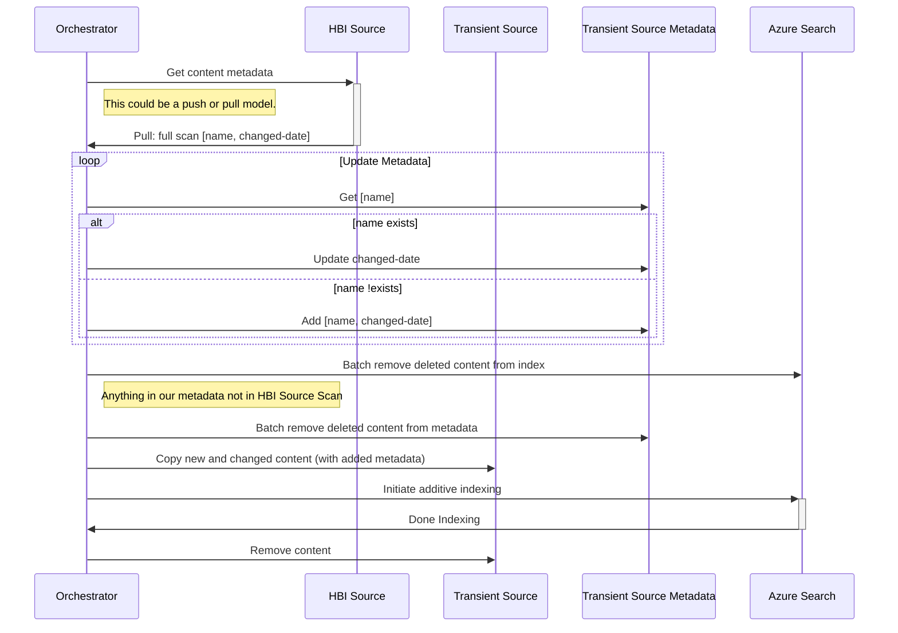

# Azure Search over HBI documents

Need help with syntax?  Check [here!](https://github.com/mermaidjs/mermaid-gitbook/blob/master/content/sequenceDiagram.md)

## Index over temporary blob storage

NOTE: More robust error handling needs to be added.

For Azure Search to track deletes for the index, blob storage must use 'soft delete'.

_The purpose of a data deletion detection policy is to efficiently identify deleted data items. Currently, the only supported policy is the Soft Delete policy, which allows identifying deleted items based on the value of a 'soft delete' column or property in the data source._

- [Blob soft delete](https://azure.microsoft.com/en-us/blog/soft-delete-for-azure-storage-blobs-ga/)
- [Azure search Add/Delete/Update rest api](https://docs.microsoft.com/en-us/rest/api/searchservice/addupdate-or-delete-documents)
